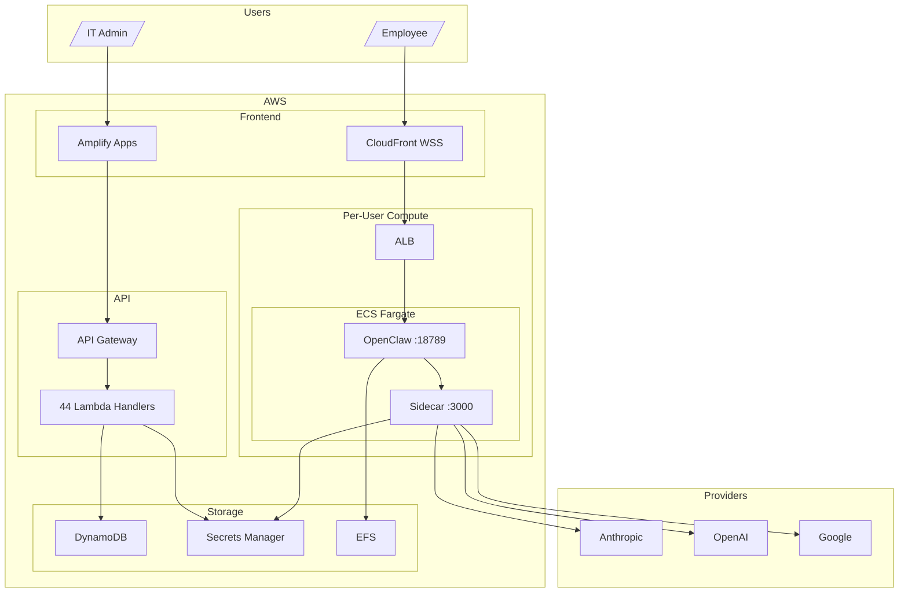

<p align="center">
  <h1 align="center">TeamClaw</h1>
  <p align="center">
    Enterprise AI Collaboration Platform built on <a href="https://github.com/openclaw/openclaw">OpenClaw</a>
  </p>
</p>

<p align="center">
  <a href="LICENSE"></a>
  <a href="https://nodejs.org"></a>
  <a href="https://github.com/ChannelDAO/teamclaw/issues"></a>
  <a href="https://github.com/ChannelDAO/teamclaw/stargazers"></a>
</p>

---

Deploy CDK. Configure API keys. Employees log in and start using AI.

TeamClaw wraps [OpenClaw](https://github.com/openclaw/openclaw) into an enterprise-ready platform with **zero source modification**. Each employee gets their own isolated AI container, backed by a centralized API key pool that IT manages — no individual key setup needed.

## How It Works

```
IT Admin deploys 4 CDK stacks → Configures API keys in admin panel
                                          ↓
              Employees sign up with company email → Get personal AI container
```

1. **Deploy** — `nx deploy infra-foundation && nx deploy infra-cluster && nx deploy infra-control-plane && nx deploy infra-admin`
2. **Configure** — Add AI provider keys (Anthropic, OpenAI, Google, etc.) in the admin panel
3. **Use** — Employees sign up with company email and start chatting

## Architecture



| Stack | Description |
|-------|-------------|
| `infra-foundation` | VPC, EFS, ECR, Secrets Manager |
| `infra-cluster` | ECS Fargate, ALB, CloudFront, Task Definition |
| `infra-control-plane` | Cognito, DynamoDB, Lifecycle Lambda |
| `infra-admin` | API Gateway, 44 Lambda handlers |

| App | Description |
|-----|-------------|
| `web-chat` | Angular 21 chat UI (WebSocket) |
| `web-admin` | Angular 21 admin dashboard |

## Features

- **Per-user container isolation** — each user runs in their own ECS Fargate task
- **Centralized API key pool** — round-robin across provider keys, no per-user setup
- **Multi-provider** — Anthropic, OpenAI, Google, OpenRouter, Mistral, and more
- **Team configuration** — SOUL.md layering (system → team → user)
- **Integration management** — Notion, Slack, GitHub, Jira, Confluence, Linear *(in development)*
- **Credential cascade** — global → team → user with `allowUserOverride` controls
- **Sidecar proxy** — credential injection + usage tracking per request
- **Admin panel** — users, teams, containers, API keys, integrations, analytics
- **Auto-stop** — idle containers stopped after 30 min, CronJob pre-wake scheduling
- **Self-service auth** — sign up, forgot password, domain allowlist

## Relationship to OpenClaw

TeamClaw wraps upstream OpenClaw with **zero source modification**. OpenClaw runs unmodified inside each container. TeamClaw adds:

- Centralized API key management (sidecar proxy)
- Per-user container orchestration (ECS Fargate lifecycle)
- Team and user configuration hierarchy (EFS + DynamoDB)
- Admin dashboard (Angular + API Gateway + Lambda)
- Integration credential management (Secrets Manager)

When OpenClaw releases a new version, update the version in `libs/teamclaw/container/Dockerfile` and rebuild.

## Quick Start

```bash
git clone https://github.com/ChannelDAO/teamclaw.git
cd teamclaw && yarn install

# Deploy (in order)
DEPLOY_ENV=prod nx deploy teamclaw-foundation-infra
DEPLOY_ENV=prod nx deploy teamclaw-cluster-infra
DEPLOY_ENV=prod nx deploy teamclaw-control-plane-infra
DEPLOY_ENV=prod nx deploy teamclaw-admin-infra
```

## Development

```bash
nx serve web-chat          # Chat UI on localhost:4200
nx serve web-admin         # Admin panel on localhost:4201
nx run-many -t test        # Run all 992 tests
nx run-many -t lint        # Lint all projects
nx run-many -t build       # Build all projects
```

## Roadmap

| Feature | Status |
|---------|--------|
| Core platform (auth, containers, key pool) | ✅ Done |
| Admin panel (users, teams, config, analytics) | ✅ Done |
| Chat UI with WebSocket | ✅ Done |
| Integration management (Notion, Slack, etc.) | 🚧 In Development |
| SSO / SAML / OIDC | 📋 Planned |
| Usage quotas and cost controls | 📋 Planned |
| Model governance | 📋 Planned |
| Team shared bots | 📋 Planned |
| Knowledge base (RAG) | 📋 Planned |
| VS Code extension | 📋 Planned |

## Contributing

See [CONTRIBUTING.md](CONTRIBUTING.md) for development setup and guidelines.

## License

[Apache License 2.0](LICENSE)
